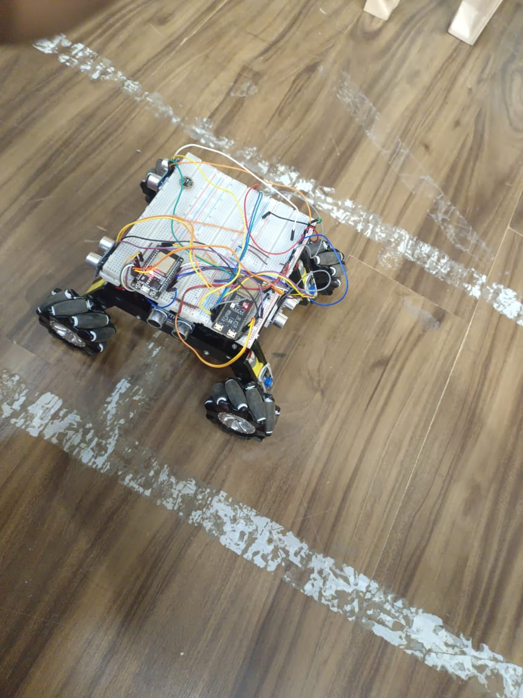
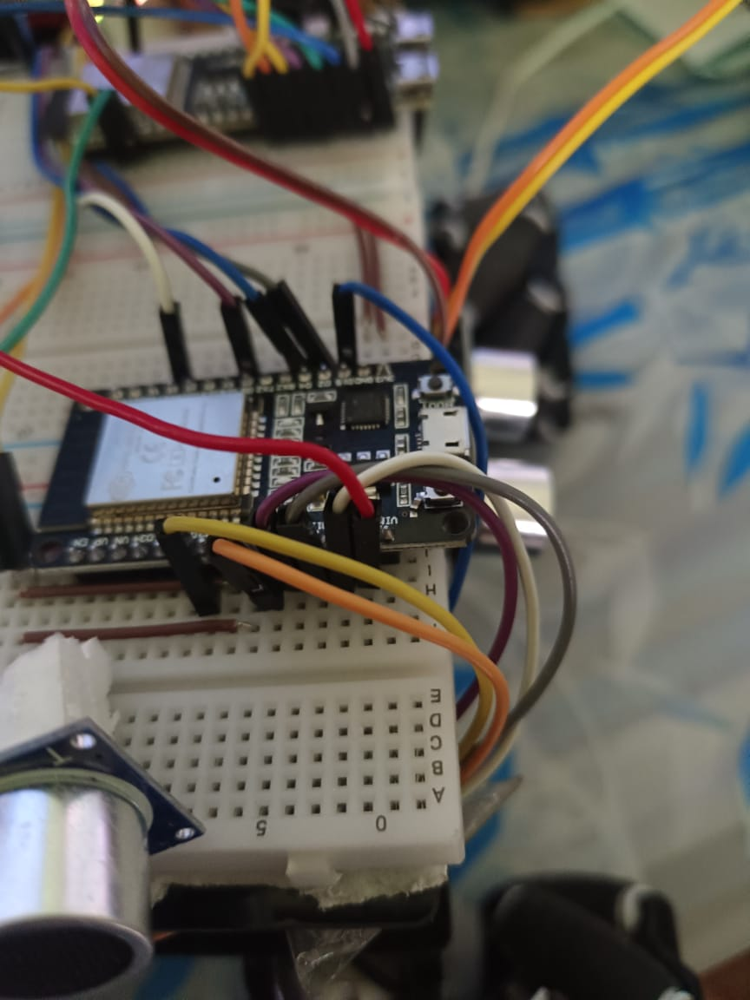

# Myra Rover Ground Controller

A versatile ground control system for the Myra Rover that supports multiple control interfaces including gamepad, voice commands, gesture control, and custom keyboard control.

## Related Repositories

This repository is part of the Myra Rover project. Here are all the related repositories:

- 🤖 [Main Repository](https://github.com/ShivanshGhelani/Myra-Rover) - Central repository for the Myra Rover project
- ⚙️ [Motor Controller](https://github.com/ShivanshGhelani/Myra-Rover-motor-controller) - ESP32-based motor control system
- 🧠 [Logic Controller](https://github.com/ShivanshGhelani/Myra-Rover-logic-controller) - Main logic and navigation system

## Features

- **Multiple Control Interfaces:**

  - 🎮 Gamepad Control
  - 🗣️ Voice Commands
  - 👋 Gesture Control
  - ⌨️ Custom Keyboard Control
  - 🤖 Programmable Sequences

- **Operating Modes:**
  - 🎮 Manual Control Mode
  - 🗣️ Voice Command Mode
  - 🤖 Semi-Autonomous Mode
  - 🔄 Easy mode switching using gamepad

- **Command System:**

  - Basic movement controls (forward, backward, left, right)
  - Advanced movements (diagonal, spinning)
  - Variable speed control
  - Emergency stop

## Command System

The rover accepts commands in hexadecimal format:

| Command                | Hex Code | Description                     |
| ---------------------- | -------- | ------------------------------- |
| STOP                   | 0x00     | Emergency stop                  |
| MOVE_FORWARD           | 0x01     | Move forward                    |
| MOVE_BACKWARD          | 0x02     | Move backward                   |
| TURN_LEFT              | 0x03     | Turn left                       |
| TURN_RIGHT             | 0x04     | Turn right                      |
| MOVE_FORWARD_LEFT      | 0x05     | Move diagonal forward-left      |
| MOVE_FORWARD_RIGHT     | 0x06     | Move diagonal forward-right     |
| MOVE_BACKWARD_LEFT     | 0x07     | Move diagonal backward-left     |
| MOVE_BACKWARD_RIGHT    | 0x08     | Move diagonal backward-right    |
| SPIN_CLOCKWISE         | 0x09     | Spin in place clockwise         |
| SPIN_COUNTERCLOCKWISE  | 0x0A     | Spin in place counter-clockwise |
| DIAGONAL_LEFT          | 0x0B     | Move diagonal left              |
| DIAGONAL_RIGHT         | 0x0C     | Move diagonal right             |
| DIAGONAL_LEFT_REVERSE  | 0x0D     | Move diagonal left reverse      |
| DIAGONAL_RIGHT_REVERSE | 0x0E     | Move diagonal right reverse     |

## Mode Switching Guide

The Myra Rover supports seamless switching between different operation modes using the gamepad:

1. **Manual Mode (Default)**
   - Full gamepad control
   - Use triggers for variable speed
   - D-pad for precise movements

2. **Voice Command Mode**
   - Press `START` button to toggle voice commands
   - Rover will respond to voice instructions
   - Press `START` again to return to manual mode

3. **Semi-Autonomous Mode**
   - Press `SELECT` button to enter semi-autonomous mode
   - Integration with [Logic Controller](https://github.com/ShivanshGhelani/Myra-Rover-logic-controller)
   - Rover uses sensors for obstacle avoidance
   - Can still accept manual override commands
   - Press `SELECT` again to return to manual mode

### Button Mapping
| Button  | Function |
|---------|----------|
| START   | Toggle Voice Command Mode |
| SELECT  | Toggle Semi-Autonomous Mode |
| B       | Emergency Stop |
| Triggers| Speed Control |
| D-pad   | Directional Control |

## Setup and Installation

1. Clone the repository:

```bash
git clone https://github.com/yourusername/myra-rover-ground-control.git
cd myra-rover-ground-control
```

2. Create and activate a virtual environment:

```bash
python -m venv venv
# On Windows
venv\Scripts\activate
# On Linux/Mac
source venv/bin/activate
```

3. Install dependencies:

```bash
pip install -r requirements.txt
```

## Project Structure

```
Ground-Controller/
├── constants.py           # Command definitions and network communication
├── gamepad_controller.py  # Gamepad interface
├── voice_controller.py    # Voice command interface
├── GestureControl.py     # Gesture recognition control
├── custom_controller.py   # Keyboard and programmable control
└── Main.py               # Main application entry point
```

## Usage

### Main Controller

```bash
python Main.py
```

This launches the main interface with support for gamepad and voice control.

### Gesture Control

```bash
python GestureControl.py
```

Use hand gestures to control the rover:

- Open palm: Stop
- Thumbs up: Forward
- Peace sign: Turn left
- Index finger: Turn right
- Index + Thumb: Spin clockwise
- Pinky + Thumb: Spin counter-clockwise

### Voice Control

Supports natural language commands like:

- "move forward"
- "turn left"
- "stop"
- "spin clockwise"

### Custom Keyboard Control

```bash
python custom_controller.py
```

- Arrow keys: Basic movement
- Q/E: Rotation
- Space: Emergency stop
- +/-: Speed control
- ESC: Quit

## Network Configuration

The controller connects to the rover's ESP32 access point:

- Default IP: 192.168.4.1
- Port: 80

To change these settings, modify the constants in `constants.py`.

## Dependencies

- mediapipe>=0.10.21 (Gesture control)
- numpy>=1.26.4
- opencv-contrib-python>=4.11.0
- inputs>=0.5 (Gamepad support)
- SpeechRecognition>=3.10.0 (Voice control)
- PyAudio>=0.2.14
- keyboard>=0.13.5 (Custom keyboard control)

## Demo Assets

### Screenshots
<details>
<summary>Click to see images</summary>

| Image 1 | Image 2 |
|---------|---------|
|  |  |

</details>

### Demo Videos
<details>
<summary>Click to see demo videos</summary>

1. [Demo Video 1](Videos/1.mp4) - Basic Movement Demo
2. [Demo Video 2](Videos/2.mp4) - Voice Control Demo
3. [Demo Video 3](Videos/3.mp4) - Gesture Control Demo
4. [Demo Video 4](Videos/4.mp4) - Semi-Autonomous Mode Demo

</details>

> Note: Videos can be found in the repository under the `Videos` folder. Due to GitHub file size limitations, some videos might be available as links to external storage.

## Contributing

1. Fork the repository
2. Create your feature branch: `git checkout -b feature/my-new-feature`
3. Commit your changes: `git commit -am 'Add some feature'`
4. Push to the branch: `git push origin feature/my-new-feature`
5. Submit a pull request

## License

This project is licensed under the MIT License - see the LICENSE file for details.

## Acknowledgments

- MediaPipe for gesture recognition
- Speech Recognition library contributors
- Input library maintainers

---

<p align="center">
Made with ❤️ by <a href="https://github.com/ShivanshGhelani">Shivansh Ghelani</a>
</p>
